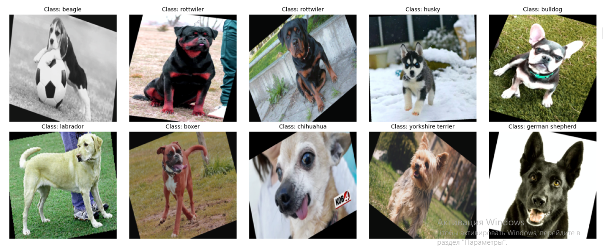
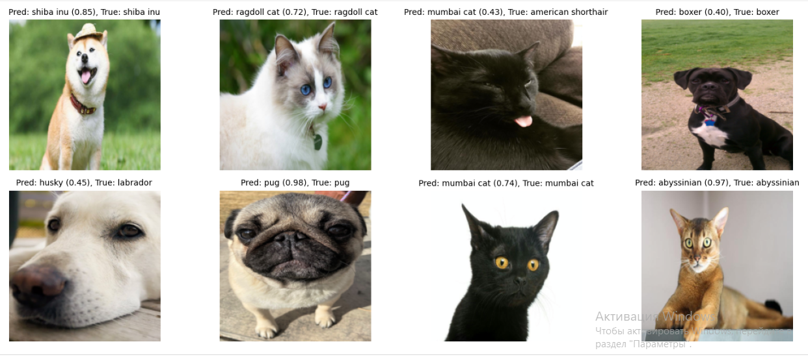
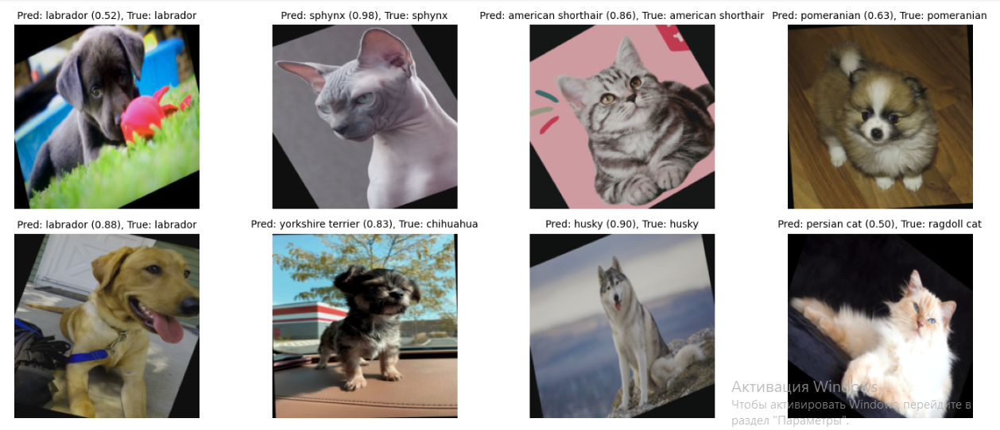
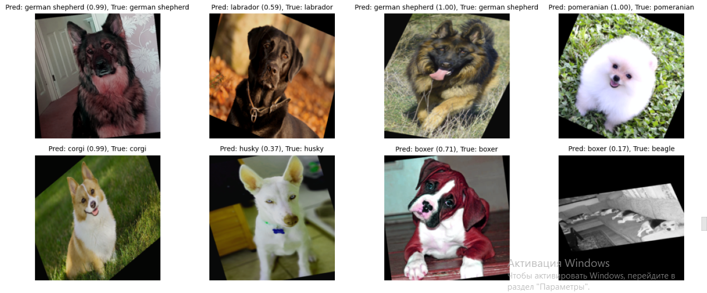
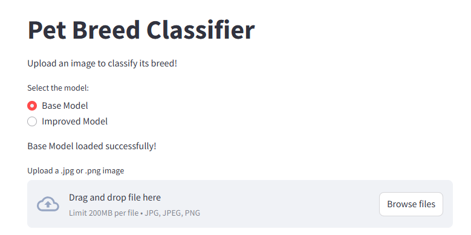
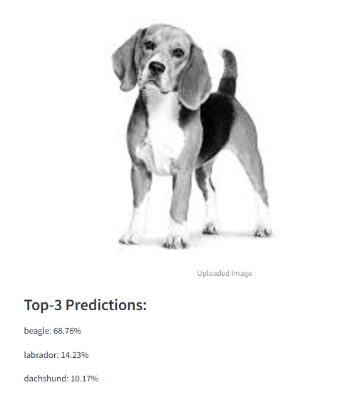
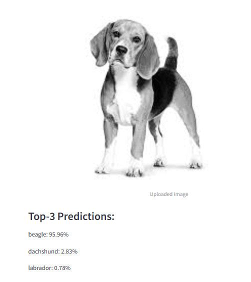

# Pet Breed Classification Using Convolutional Neural Networks

This project focuses on classifying images of 23 different pet breeds using convolutional neural networks (CNNs). The model was trained and tested on the [23 Pet Breeds Dataset](https://www.kaggle.com/datasets/aseemdandgaval/23-pet-breeds-image-classification), showcasing effective deep learning techniques for image classification.

---

## Project Overview

The primary goals of this project were:
1. **Model Development:** Build and fine-tune CNN models to classify pet breeds accurately.
2. **Performance Improvement:** Improve baseline model performance by adding layers or custom blocks.
3. **Deployment:** Deploy the best-performing model using Streamlit to create an interactive and user-friendly interface.

---

## Dataset

The dataset consists of labeled images for 23 different pet breeds. Each image was preprocessed and split into training, validation, and test sets. Detailed exploratory data analysis was conducted to understand dataset characteristics.

- **Dataset Link:** [23 Pet Breeds Dataset on Kaggle](https://www.kaggle.com/datasets/aseemdandgaval/23-pet-breeds-image-classification)
- **Dataset Summary:**
  - Number of breeds: 23
  - Image resolution: Varies
  - Preprocessing: Resized and normalized for CNN compatibility

---

## Key Features

- **Model Training Process:** Comprehensive steps for training the model, including dataset preparation, augmentation, model building, and optimization.
- **Metrics and Improvements:** Documented performance metrics with visualizations, showcasing improvements through modifications in architecture and hyperparameters.
- **Deployment:** Final model deployed using Streamlit for live testing through a graphical interface.
- **Code Organization:** Clean and modular Python code to ensure reproducibility.

---

## Screenshots

### Data
.

### Prediction after base_model training

### Prediction after improved_model training

### Final predictions

### Streamlit App Interface
- ** You can play with our model on this link:** [Link to Streamlit app](https://petbreeds-bda2206.streamlit.app/)

### Base model predictions

### Improved model predictions

